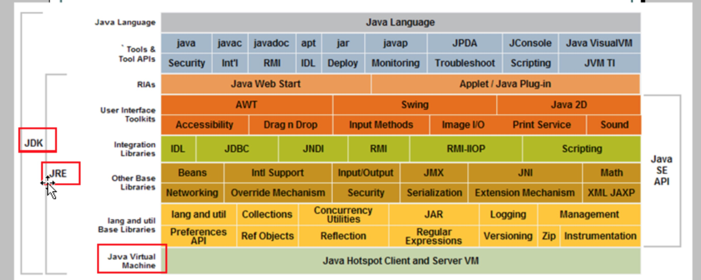

## JAVA基础

#### 1.1 跨平台

	JAVA 三种技术结构

		1. J2EE  企业版    web应用程序开发

		2. J2SE  标准版    桌面应用程序开发

		3. J2ME  小型版    嵌入式程序开发

		
	JAVA5.0以后更名为 JAVAEE  JAVASE  JAVAME

	JAVA 跨平台性  跨平台基础: JVM---JAVA虚拟机  而JAVA虚拟机是分平台

	JRE: java runtime Environment JAVA运行环境
	
		包括 JVM 和 JAVA核心类库

	JDK: java Development kit  JAVA开发工具包

		包括 java开发工具 和 JRE

		所以安装JDK 就不用单独安装JRE

		其中开发工具包括: 编译工具 javac.ext 和 打包工具 jar.exe

		简单而言 用JDK开发完成的java程序 交给JRE运行

	MAC下Java安装目录:
		
		/Library/Java
	
	window环境变量:
		
		jdk+bin;
		
		JavaPosition: D:\jdk1.6.0_24   # JavaPosition是环境变量名
		
		PATH=%JavaPosition%\bin        # %JavaPosition% 对JavaPosition环境变量求值
		
		临时配置环境变量:
		
		 在DOS下用set命令 设置、查看环境变量  只对当前窗口有效
		 
		 set # 查看所有环境变量
		 
		 set path # 查看环境变量path的值
		 
		 set path=Java_home\bin;%path%
		 
		 
	设置classpath
	
		set classpath=想要设置类路径(;)  # 如果不加这个分号 就不再去当前目录下找 只在指定classpath下找
		
		这样运行java Demo的命令的时候 java就会指定classpath目录下寻找相应Demo.class文件
		
		如果找不到 再在当前目录下寻找Demo.class文件
		

1.1.1 Java类名规范
	
	首字母大写  每个单词首字母大写
		 
		
1.1.2 Java注释
	
		1. //  单行注释
		
		2. /*
			多行注释  不能嵌套
			
		   */
		   
		 3. /**
			文档注释  
			
		   */
		   
		   用于javadoc命令

1.1.3 关键字

1.1.4 标识符
	
	字母大小写  数字0-9 _下划线 $
	
	不能以数字开头
	
	不可以使用关键字
	
	区分大小写
	
	包名
		
		多单词组成时所有字母都小写
	
	类名 接口名
	
		多单词组成  所有单词首字母大写
	
	变量名 函数名
	
		多单词组成  第一个单词收字母小写 剩余单词首字母大写
	
	常量名
	
		所有字母大写 多单词时每个单词用下划线连接
	

1.1.5 常量与变量

	常量  不能改变的值
		
		整数
		
		浮点数
		
		布尔型
		
		字符      单引号
		
		字符串     双引号
		
		null常量
		
		整数表现形式:
			
			十进制   0-9
			
			八进制   0-7 用0开头
			
			十六进制  0-9 A-F 用0x开头
		
		负数:
		
			取反+1
			
	
	变量
	
		变量空间有数据类型  变量名称来确定的
		
		根据不同数据类型 分配了不同大小的内存空间
		
		
	数据类型
	
		基本数据类型
		
			数值
				
				整数 
					
					byte       1 * 8
					
					short      2 * 8
					
					int        3 * 8 默认
					
					long       4 * 8
					
						long l = 4l;
				
				浮点数
				
					float      4 * 8
					
						float f = 2.3f
					
					double     8 * 8  默认
			
			字符  char          2 * 8
			
			布尔  boolean
				
				true false
				
				
		引用数据类型
		
			类 class
			
			接口 interface
			
			数组 array
		
		
		A 65 a 97
		
		自动类型转换   隐士类型转换    低向高转换
		
		强制类型转换   显示类型转换    
		
		表达式的数据类型自动提升
			
			byte short char 都将被提升到int
			
			若一个long 结果是long
			
			若一个float 结果是float
			
			若一个double 结果是double
			
		System.out.println('a') 与 System.out.println('a' + 1)区别
			
			前者是字符型  后者自动类型为int
			
1.1.6 转义字符
	
		\n  换行
	
		\r  回车键    window系统中 回车符是由两个字符来表示\r\n
	
		\b  退格
	
		\t  制表符
		
			
1.1.7 运算符

	instanceof 检验对象是某个类的实例
	
	& 与 && 区别 前者不短路 后者短路
	
	| 与 || 区别 前者不短路 后者短路
	
	>> 有符号有移
	
	>>> 无符号右移
	
	三元运算符: (条件表达式) ? 表达式1 : 表达式2
	

1.1.8 控制语句

	if () 
	{
	
	}
	
	if () {
	
	} else {
		
	}
	
	if () {
	
	} else if{
		
	} else {
	
	}
	
	switch (值) {  // 值只能是 byte short int char 四种类型
		case 值1:
		
			break;
		...
		
		default:
			// code
			break;
	
	}
	
	switch的case 和 default定义顺序顺便
	
	执行顺序是固定的先找case执行 最后执行default
	
	switch结束条件:
		
		1. 遇到break
		
		2. 遇到switch的右大括号
	
	while () {
	
	}
	
	do {
		
	} while ();
	
	for (初始化表达式; 循环判断表达式; 循环后操作表达式) {
		// 初始化表达式 只运行一次
		
		// 循环判断表达式 表达式结果为true 才运行循环体  默认不写是true
		
		// 执行完循环体后 执行循环后的操作表达式 再去执行循环判断表达式
		
		表达式多的时候用逗号隔开Test05.java
		
	}
	// for无限循环
	for(;;){
	}
	
	
	break语句
		
		应用范围  选择结构和循环结构  结束单层循环
		
	continue语句
	
		应用范围  循环结构  结束本次循环然后继续下次循环
		
1.1.9 函数
	
	定义  完成一个特定功能的一段小程序 也成方法
	
	格式
		修饰符 返回值类型  函数名 (参数类型 形成参数1,...) {
			执行语句
			return 返回值;
		}
	
	
	重载
	
		只与参数列表相关
	

1.1.10 数组
	
	定义
		
		同一种类型数据的集合  其实数组就是一个容器
		
	格式
		
		1. 元素类型[]数组名 = new 元素类型[数组长度];
			
			int[] arr = new int[15];
			
		2. 元素类型[]数组名 = new 元素类型;
		
			int[] arr = new int;
			
	二维数组
		
		格式
		
			int[][] arr = new int[3][4];
			
			int[][] arr = new int[3][];

			int[][] arr = {{1,2}, {0, 2, 3}};
			
			int[] x; y[]; // x 一维  y 二维
			
			这里等于 int[] y[];  不推荐
			
1.1.11 作用域
	
	JAVA的变量变量作用域  全局作用域  块级作用域
	
	for中的初始化表达式声明的变量 就是块级作用域
	
	

