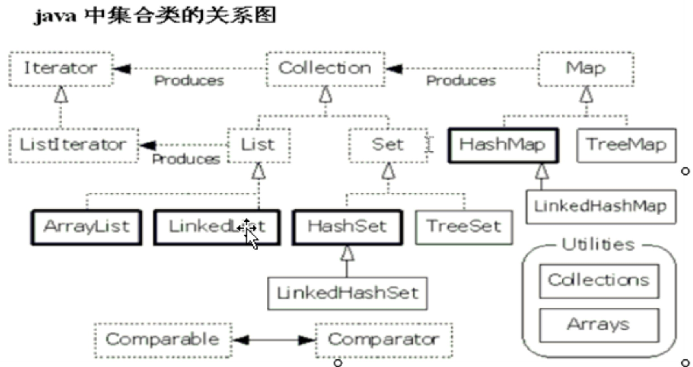

## 集合框架

#### 5.1 集合类

5.1.1 为什么出现集合类？
	
	面向对象语言对事物的体现都是以对象的方式 所以为了方便对多个对象的操作 就对对象进行存储 集合就是存储对象最常用的一种方式
	
5.1.2 数组和集合类都是容器 有何区别?
	
	数据虽然也可以存储对象 但是长度是固定的  集合长度是可变的
	
	数组中存储基本数据类型  集合只能存储对象
	
5.1.3 集合类的特点

	集合只用于存储对象 
	
	集合长度可变
	
	集合可以存储不同类型的对象
	

#### 5.2 集合框架
	
5.2.1 集合框架

	Collection  集合框架顶类

		|-- List 元素有序 可以重复 有索引
			
			|-- ArrayList  底层的数据结构是数组  查询速度快  增删慢  线程不同步
			
			|-- LinkedList 底层的数据结构是链表  查询慢   增删块
			
			|-- Vector     底层的数据结构是数组 与ArrayList类似 区别就是线程同步的 被与ArrayList替代

		|-- set 元素无序 不可以重复 
		
			|-- HashSet
			
			|-- TreeSet
	

			
5.2.2 为何集合框架有很多不同容器
		
	因为每一个容器对数据的存储方式都有不同
	
	这个存储方式称之为: 数据结构
	
	
5.2.3 Collection

	是接口
	
	集合存储是对象地址
	
	iterator 迭代器 是一个接口
	
		hasNext() 判断是否还有下一个
		
		next()  返回下一个元素
		
	把取出方式定义在集合内部 这样取出方式就可以直接访问集合内容的元素
	
	那么取出方式的被定义成了内部类
	
	而每一个容器的数据结构不同 所有取出的 动作细节也不一样 但是都有共性内容 
	
	就是判断和取出这两个步骤  那么可以将写共性进行抽取
	
	那么这些内部类都符合一个规则 该规则就是iterator
	
	如何获取集合的取出对象呢？
		
		通过一个对外提供的方法 iterator() 方法
		
	最好用for 
	
	for (Iterator it = al.iterator(); it.hasNext();) {
		it.next();
	}
	
5.2.4 List
	
	凡是可以操作角标的方法都是该体系特有的方法
	
	.size()  length
	
	.add(index,object) 这个index可以省略 
	
	.get(index)
	
	.set(index, object)
	
	.remove(index)
	
	.indexOf(object)
	
	listIterator  列表迭代器 是Iterator的子接口
	
		在迭代时候 不可以通过集合对象的方法操作集合中的元素
		
		因为会发生 concurrentModificationException 异常
	
			当方法检测到对象的并发修改 单不允许这种修改时 抛出异常
			
				it.remove() 迭代时候自己删除自己
				
		所以 在使用迭代器时候 只能用迭代器的放过的操作元素 可是Iterator方法是由有限的
		
		只能对元素进行判断 取出 删的的操作
		
		如果想要其他的操作如添加 修改 就需要使用其子接口 如listIterator
		
		该接口只能通过List集合的listIterator方法获取
	
	

5.2.5 ArrayList Vector

	区别：
		
		两者默认是长度10
		
		ArrayList如果超过10的时候 会生成一个原来长度150%的新数组 然后把原来的数组内容拷贝到新数组中
		
		Vector如果超过10的时候 会生成一个原来长度200%的新数组 然后把原来的数组内容拷贝到新数组中
		