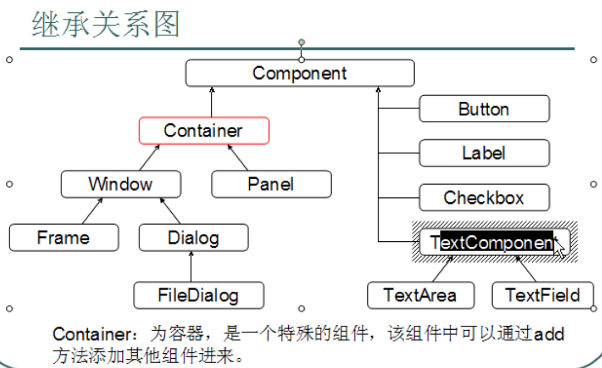

## GUI 图形用户界面

#### 9.1 GUI

	Graphical User Interface 图形用户接口
	
	CLI Command line User interface 命令行用户接口
	
	Java为GUi提供对象存在java.awt 和 java.Swing两个包中
	

#### 9.2 AWT

	abstract window Toolkit 抽象窗口工具包
	
		需要调用本地系统方法实现功能 属重量级控件
		
		所谓重量级 是严重依赖于系统
		

#### 9.3 Swing

	在AWT的基础上 建立的一套图形界面系统 提供了更多的组件 
	
	完全由Java实现 增强移植性 属轻量级控件

#### 9.3 继承关系图

